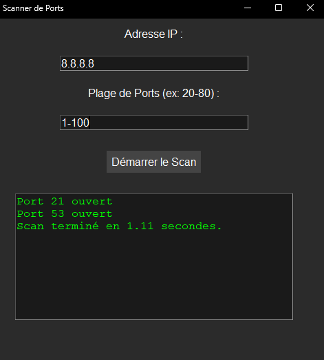
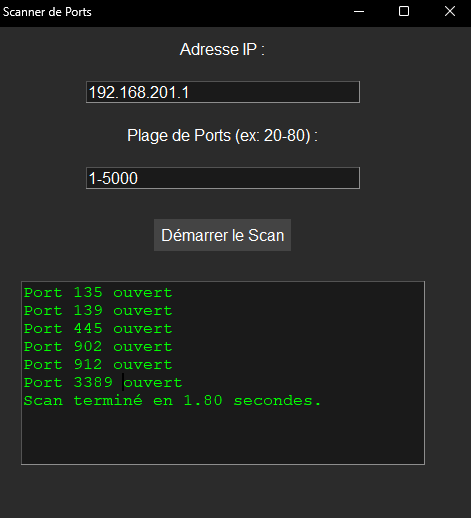

# Scanner de Ports

Un scanner de ports simple, développé en Python avec Tkinter pour une interface graphique, permettant de scanner une plage de ports spécifiée sur une adresse IP donnée. Ce projet permet de tester la disponibilité de ports sur un serveur ou une machine cible. (Protocol TCP)

## Fonctionnalités

- Scanner une plage de ports spécifiée sur une adresse IP.

- Affiche les ports ouverts ou un message si aucun port n'est ouvert.
- Support via un exécutable `.exe`.


## Prérequis

- Python 3.x
- Les bibliothèques Python suivantes :
  - `tkinter`
  - `socket`
  - `threading`
  - `re`
  - `time`

installer ces bibliothèques avec `pip` si nécessaire :
```bash
pip install tkinter
